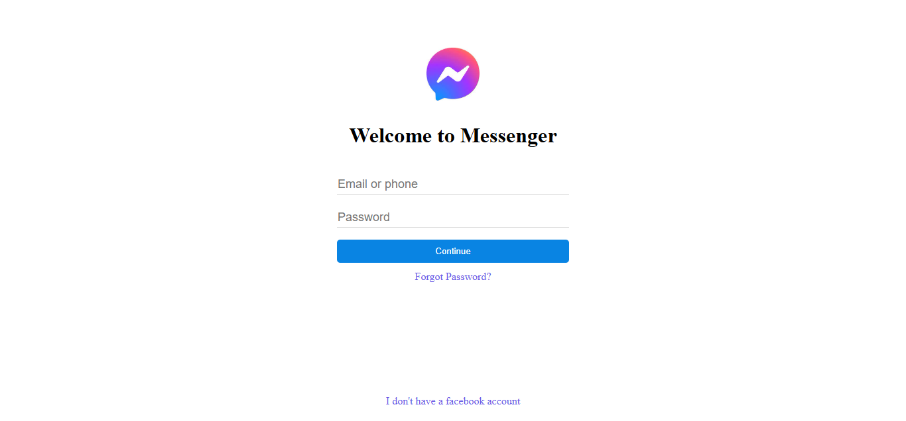

# Messenger Login Page Clone

This project is a simple clone of the Messenger login page, created using HTML and CSS. It aims to replicate the look and feel of the original Messenger login interface.

## Project Overview

The Messenger Login Page Clone is designed to mimic the visual style and layout of the official Messenger login page. This project serves as a practice in front-end development, focusing on HTML structure and CSS styling.

## Technologies Used

- HTML5
- CSS3

## Features

- **Responsive Layout**: The design is optimized to look similar to the Messenger login page on different devices.
- **Simple Styling**: Uses only HTML and CSS.

